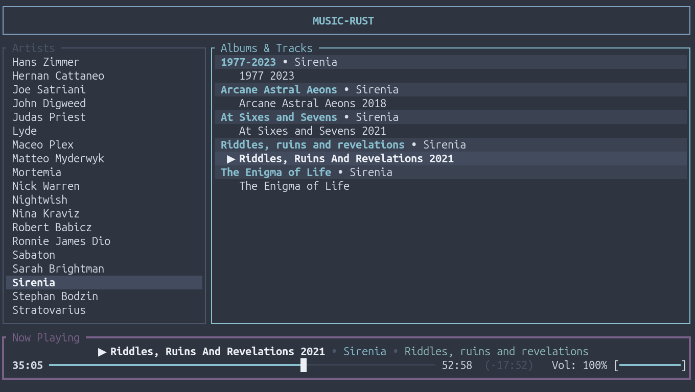
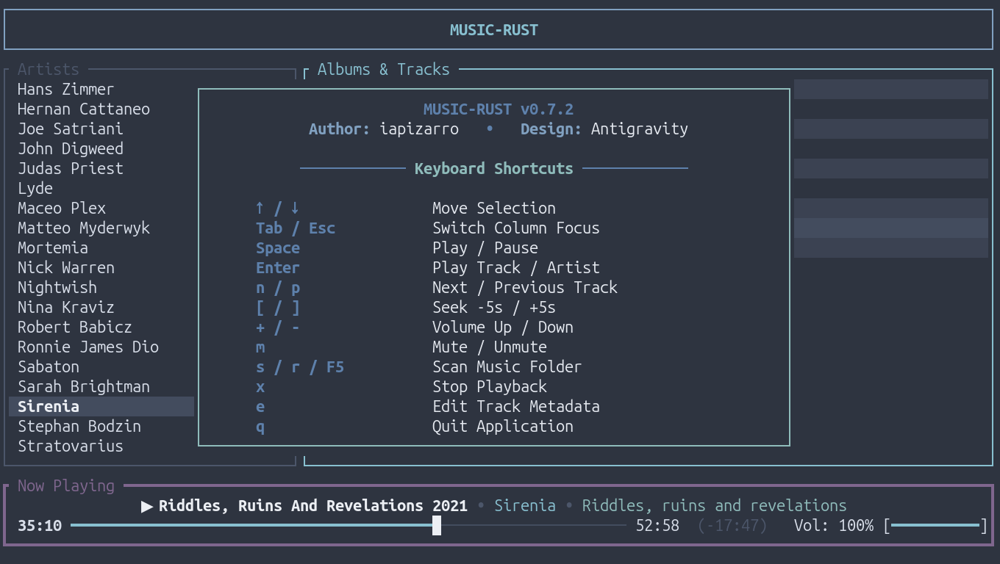
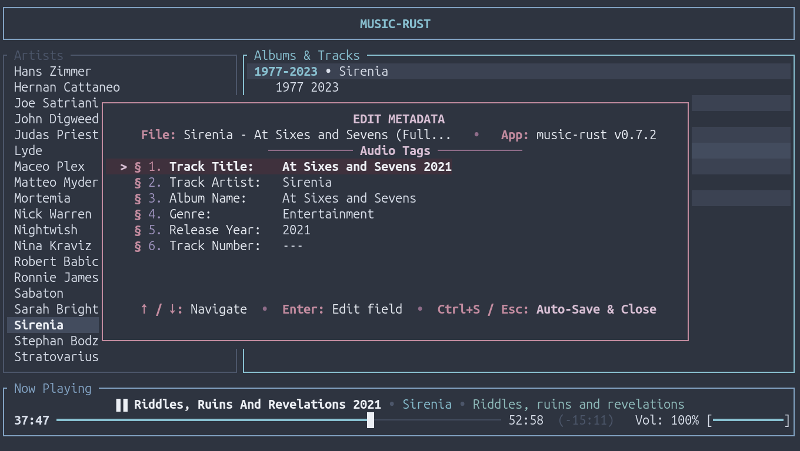

# music-rust

> Nord-themed Terminal Music Player written in Rust with interactive mouse & keyboard controls.

## Overview
`music-rust` is a fast, lightweight, keyboard and mouse-driven terminal music player built using [ratatui](https://github.com/ratatui/ratatui) and [crossterm](https://github.com/crossterm-rs/crossterm). It decodes all standard audio formats (MP3, FLAC, OGG, WAV, AAC, M4A, OPUS, WMA) via Symphonia / rodio, and features full media key integration (MPRIS / Souvlaki).

> **Inspiration**: This project was inspired by [musikcube](https://github.com/clangen/musikcube) by Casey Langen.


## Features
- 🌲 **Nord Color Palette**: Polar Night, Snow Storm, Frost, and Aurora theme colors.
- 🖱️ **Full Mouse Support**: Click artist/song rows, drag interactive seekbar, drag volume slider, and scroll lists.
- ⌨️ **Keyboard Controls**: Vim navigation, space for play/pause, track skipping, and volume control.
- 🎚️ **Format Support**: MP3, FLAC, OGG Vorbis, WAV, AAC, M4A, OPUS, WMA.
- 🖥️ **OS Integration**: MPRIS media key support (Play/Pause, Next, Previous, Stop, Seek) for system media controls.

## Screenshots

| Main Music Player | About & Shortcuts Modal |
| :---: | :---: |
|  |  |

| Audio Metadata Editor |
| :---: |
|  |


## Prerequisites

### 1. Rust & Cargo
Install via [rustup](https://rustup.rs/):
```bash
curl --proto '=https' --tlsv1.2 -sSf https://sh.rustup.rs | sh
```

### 2. System Audio & DBus Development Libraries
- **Debian / Ubuntu / Linux Mint / Pop!_OS**:
  ```bash
  sudo apt install libasound2-dev libdbus-1-dev pkg-config
  ```
- **Fedora / RHEL / CentOS**:
  ```bash
  sudo dnf install alsa-lib-devel dbus-devel pkgconf-pkg-config
  ```
- **Arch Linux / Manjaro**:
  ```bash
  sudo pacman -S alsa-lib dbus pkgconf
  ```
- **openSUSE**:
  ```bash
  sudo zypper install alsa-devel dbus-1-devel pkg-config
  ```

## Installation
```bash
./install.sh
```
This compiles the optimized release binary and installs it to `~/.local/bin/music-rust`.

For custom installation prefix (e.g. system-wide):
```bash
./install.sh --prefix=/usr/local
```

## Uninstallation
```bash
./install.sh --uninstall
```

## CLI Usage
```
Usage: music-rust [OPTIONS]

Options:
  -m, --music-dir <MUSIC_DIR>  Directory containing music files (defaults to ~/Music or current directory)
  -h, --help                   Print help
  -V, --version                Print version
```

## Controls & Shortcuts
| Key / Input | Action |
| :--- | :--- |
| `j` / `Down` | Move selection down |
| `k` / `Up` | Move selection up |
| `Tab` / `Esc` / `Left` / `Right` / `h` / `l` | Switch focus between Artists and Albums & Tracks |
| `Home` / `g` | Jump to top of active list |
| `End` / `G` | Jump to bottom of active list |
| `PageUp` / `PageDown` | Scroll list by 10 items |
| `Space` / `Media Play` | Play / Pause |
| `Enter` / `Double-Click` | Play selected track / artist |
| `n` / `Media Next` | Next track |
| `p` / `Media Prev` | Previous track |
| `[` / `]` or `,` / `.` | Seek -5s / +5s |
| `{` / `}` or `<` / `>` | Seek -30s / +30s |
| `0` | Restart current track |
| `s` / `r` / `F5` | Scan / Rescan music folder for changes |
| `x` / `Media Stop` | Stop playback |
| `+` / `=` | Increase volume |
| `-` / `_` | Decrease volume |
| `m` | Toggle mute / unmute |
| `Mouse Click / Drag` (Progress) | Seek to track position |
| `Mouse Click / Drag` (Volume) | Adjust volume level |
| `Mouse Scroll` | Scroll lists / Adjust volume on controls |
| `e` | Edit track metadata (title, artist, album, genre, year, track #) |
| `a` / `?` | Toggle About & Shortcuts overlay |
| `q` / `Ctrl+C` | Quit player |

## Bug Reports & Feedback
Found a bug, have an audio decoding issue, or want to request a feature?
- Open an issue on GitHub: [Issues Tracker](https://github.com/iapm2024/music-rust/issues)
- Pull requests and suggestions are welcome!

## Acknowledgements
- [musikcube](https://github.com/clangen/musikcube) by Casey Langen — for the original inspiration of an elegant 24-bit terminal audio workstation.

## License
Licensed under [GNU General Public License v3](LICENSE).  
Author: iapizarro (iapm2024).


